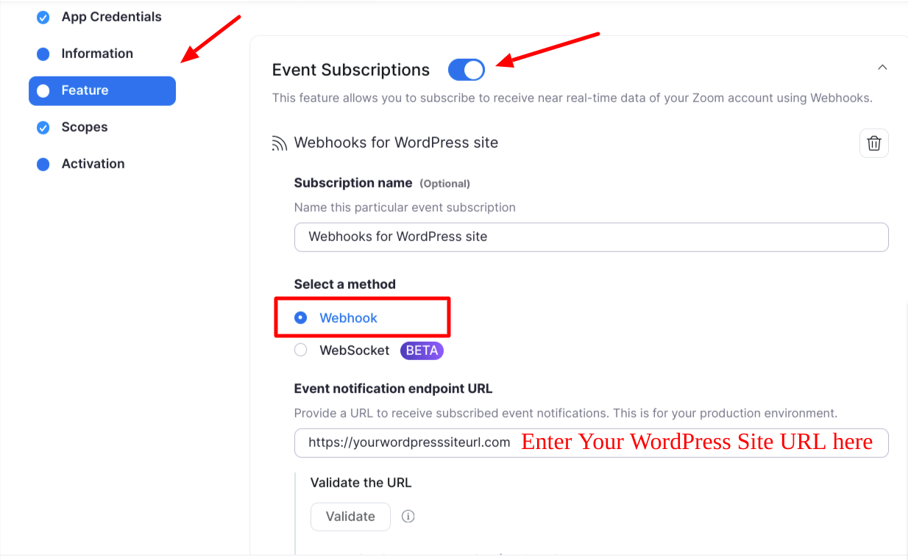
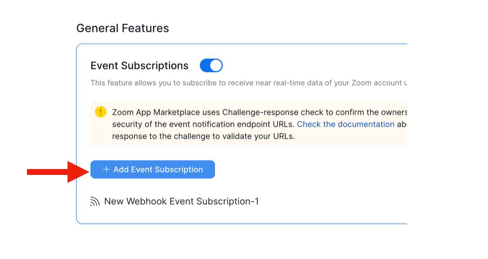
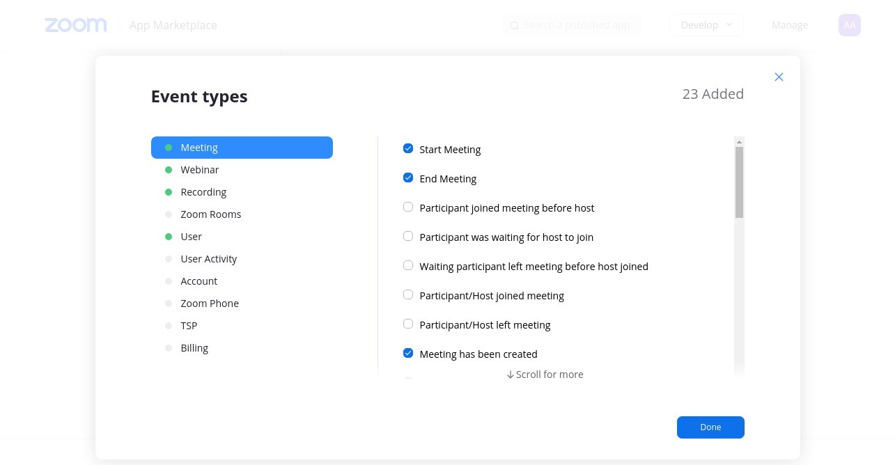
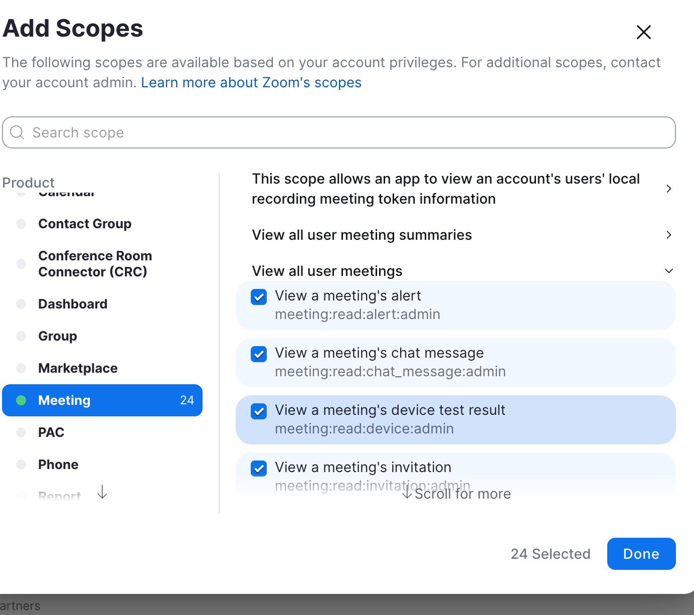
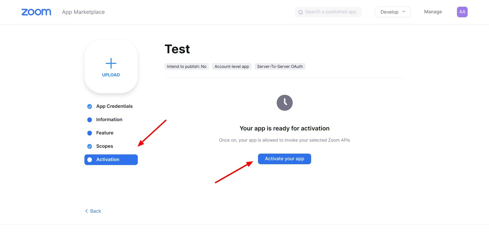
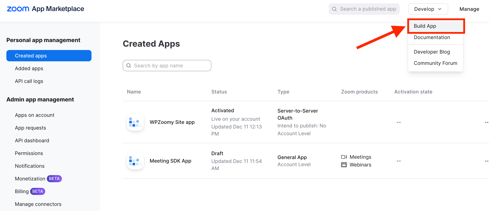
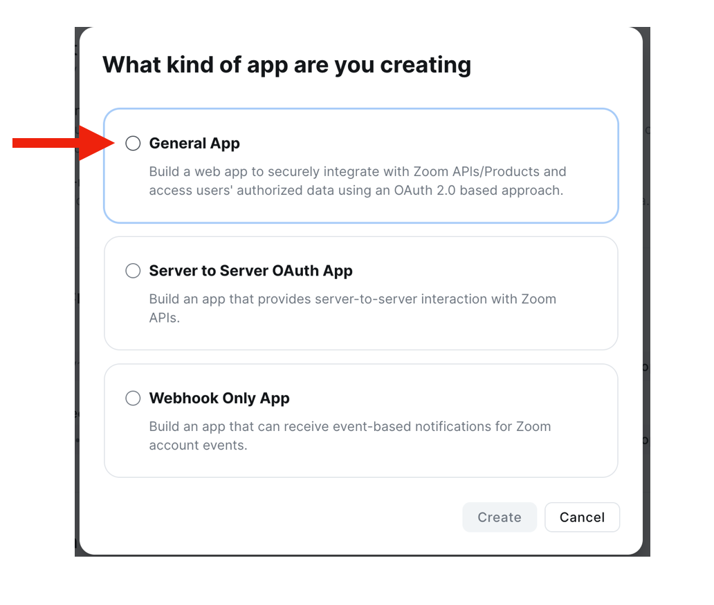
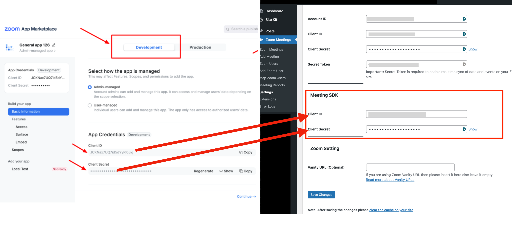
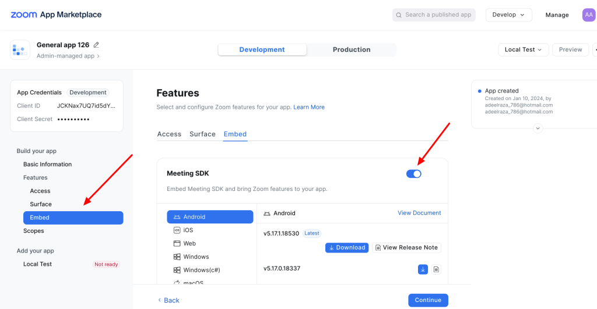
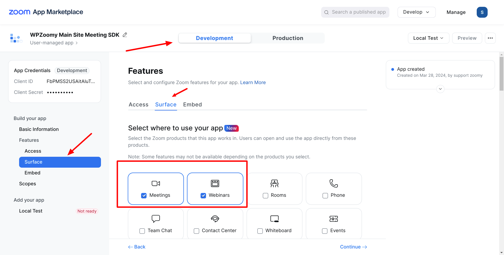

# Creating Server-to-Server OAuth App

This is a step-by-step guide to help you setup create a Zoom App to integrate with the Zoomy plugin.

In order for Zoomy to connect with Zoom, you need to first create a OAuth App with your Zoom account. This part can feel technical, but just follow the steps and you will be up and running in no time at all!

## 1. Create a Server-to-Server OAuth App

For Zoomy to connect with Zoom, you need to first create an OAuth App with your Zoom account. This part can feel technical, but just follow the steps and you will be up and running in no time at all!

* First of all, log in to the **Zoom App Marketplace** with an **owner**/**admin-level** account.
* Click on Develop -> Build Server-to-Server OAuth App and create this app.  
  **Note:** If you can't see the Server-to-Server OAuth app type on this screen then refer to this Zoom [guide](https://developers.zoom.us/docs/internal-apps/s2s-oauth/).
* Copy the App credentials i.e. Account ID, Client ID, and Client Secret. Add these values inside your plugin settings under,  
  **Zoom Meetings -> Settings -> Setup -> Server-to-Server OAuth**


## 2. Event Subscriptions

Events Subscription allows the Zoom plugin to listen for changes on your Zoom account and sync them on your WordPress site for better integration.

* Select **Feature** from the side menu and copy the **Secret Token**.
  * On your WP Admin Site, go to **Zoom Meetings -> Settings -> Server-to-Server OAuth -> Secret Token** paste the Secret Token into the field, and click save.


* Go back to Zoom Enable Events Subscription and then click "Add Event Subscription"
  * In Select a method, go with the default Webhook method.
  * Paste your WordPress site URL into the "**Event notification endpoint URL**" field and click **Validate**.
  * If validation fails, attempt using this URL in place of your main site URL, replacing "yourwpsiteurl" with your actual site URL: `https://yourwpsiteurl.com/wp-json/wp/v2`
  
  **Note:** If the domain fails to validate, double-check that you have completed step 1 above.
  

* Click Add Events under the Event types and check **only the events listed below** click done once you have checked all the relevant events:



### Event types

**Meeting & Webinar:**
* Start Meeting/Webinar
* End Meeting/Webinar
* Meeting/Webinar has been created
* Meeting/Webinar has been updated
* Meeting/Webinar has been deleted
* *Optional: If using registered Meeting/Webinar*
  1. Meeting/Webinar Registration has been created
  2. Meeting/Webinar Registration has been canceled
  3. Meeting/Webinar Registration has been denied

**Recording:**
* All Recordings have completed
* Recording files have been deleted to Trash
* Recording files have been permanently deleted
* Recording files have been recovered from Trash

**User:**
* User has been deleted
* User has been activated
* User's profile info has been updated



* Now click **Save** to keep your changes intact.

**Note:** If you are using Zoom WordPress Plugin on multiple WordPress sites or a **WordPress Multisite** then you must Add a new event subscription for each of your sites.

## 3. Set Scopes and Permissions

* Click the **Scopes** menu -> **Add scopes**. Then, search for the scopes listed below and enable them.  
  **Note:** If you see a permission error on the scopes menu then refer to this Zoom [guide](https://developers.zoom.us/docs/internal-apps/s2s-oauth/).

### Add Scopes

**Users:**
```
user:read:list_users:admin
user:write:user:admin
user:read:user:admin
```

**Meeting:**
```
meeting:read:list_meetings:admin
meeting:read:meeting:admin
meeting:write:meeting:admin
meeting:update:meeting:admin
meeting:delete:meeting:admin
meeting:update:status:admin
```

**Webinar (Optional, If using Zoom Webinar):**
```
webinar:read:list_webinars:admin
webinar:read:webinar:admin
webinar:write:webinar:admin
webinar:update:meeting:admin
webinar:delete:meeting:admin
webinar:update:status:admin
```

**Recording:**
```
cloud_recording:read:list_recording_files:admin
cloud_recording:read:list_user_recordings:admin
```

**Report:**
```
report:read:daily_usage:admin
report:read:user:admin
report:read:list_meeting_participants:admin
```

**Note:** If you see a permission error on the scopes menu then refer to this Zoom [guide](https://developers.zoom.us/docs/internal-apps/s2s-oauth/).



## 4. Activate app

The last step is to activate the App so that you can use add the App credentials in the plugin settings.

**Note:** If the app is not activated the app credentials will not work.



---

Another app is required to enable your users to join Zoom meetings on the frontend

---

## 5. Create a Meeting SDK App

* Another app is required to enable your users to join Zoom meetings on the frontend
* Click on **Develop -> Build app**



* Then click "**General App**"



* From the Development Tab, copy the App credentials i.e. Client ID and Client Secret. Add these values inside your plugin settings under,  
  **Zoom Meetings -> Settings -> Setup -> Meeting SDK**

  


* From **Features -> Embed** enable the toggle for Meeting SDK. This will make the app usable as a meeting SDK app.



* From **Features -> Surface** check to enable the Webinars option if you embed and display Webinars on your WordPress site frontend.




### Note: There is no need to fill in any other details or publish this app. You are done.

That's all, after completing all these steps you should be up and running with the Zoomy WordPress plugin!
