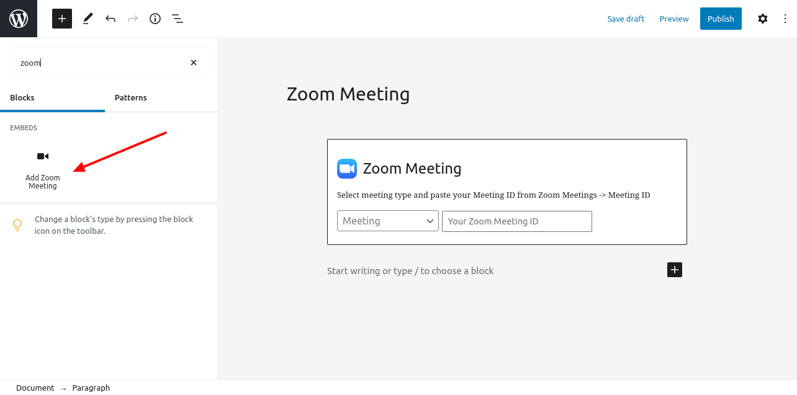
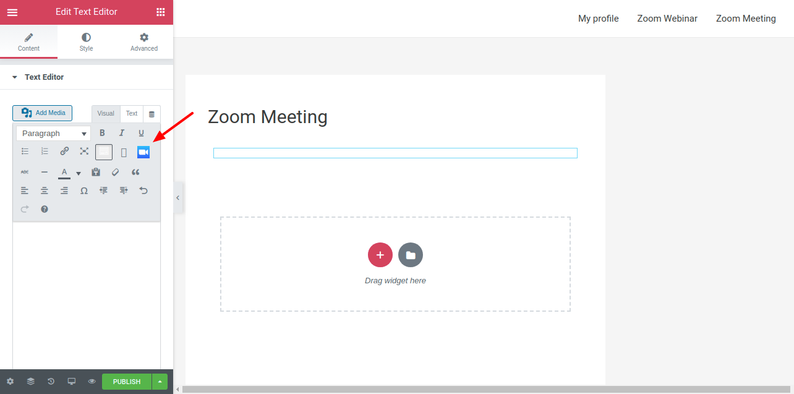
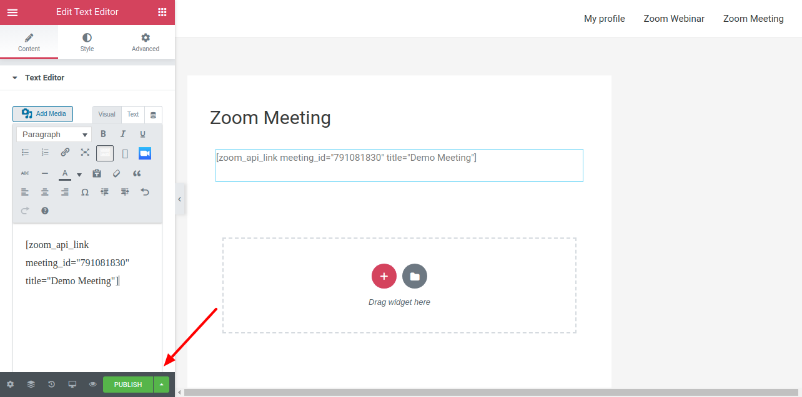
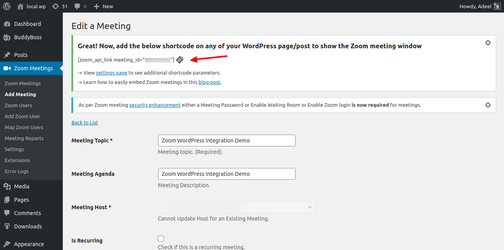

# Embed Zoom Meeting on WordPress

How to add a zoom meeting to your Wordpress posts or pages using Zoomy.

<AuthorBlock />

The [**Zoom WordPress Plugin**](https://wpzoomy.com/) v4.5.0 adds a user-friendly way to embed Zoom Meeting/Webinar right from your WordPress editor.

## 1. Gutenberg Block To Embed Zoom Meeting

a. A gutenberg block has been added under the EMBEDS category to embed the Zoom Meeting/Webinar on the frontend. Simply select whether you want to embed a Meeting or a Webinar and paste your Zoom Meeting ID in the text field. Now save and view the Zoom meeting window on the frontend.

b.   

## 2. From Classic WordPress Editor

a. If you are not using Gutenberg then you can use this method to generate the meeting shortcode from your editor. In this example, we will see how it works with Elementor.

b. Select the Text Editor element.

c. Click the Zoom icon in Visual Tab.

d.

e. Choose whether you want to embed a Zoom Meeting or Webinar and select the meeting you want to embed on this page.

f. Once you press Ok, the plugin will generate the Meeting shortcode for you. That's it, publish your changes and view the Zoom meeting window on the frontend.

g.  

## 3. Direct Shortcode Embed

a. There is also an option to add the meeting shortcode directly to your WordPress page/post. Create a Zoom meeting from the plugin menu **Zoom Meetings -> Add Meeting**, copy the shortcode from the icon indicated below, and paste it on your preferred WordPress page/post.

b.  
