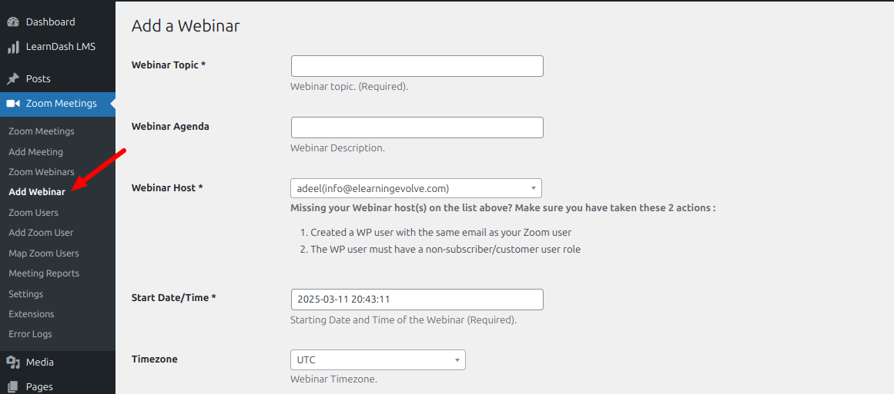
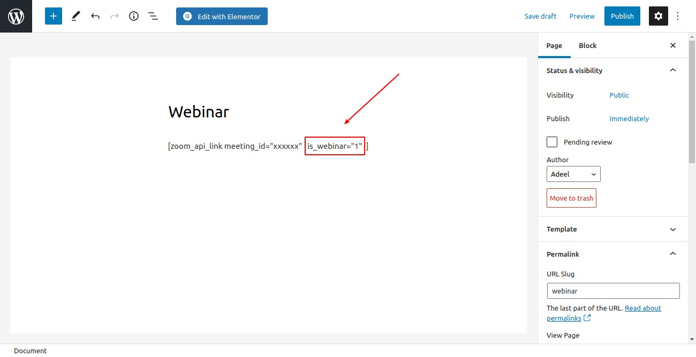
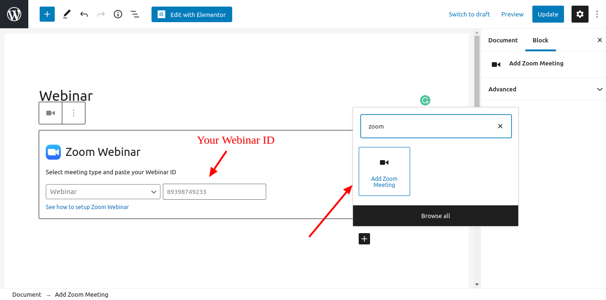
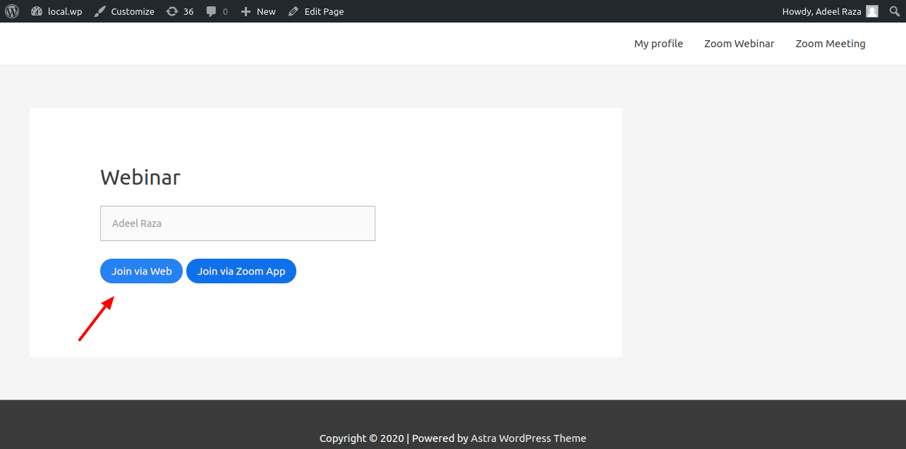
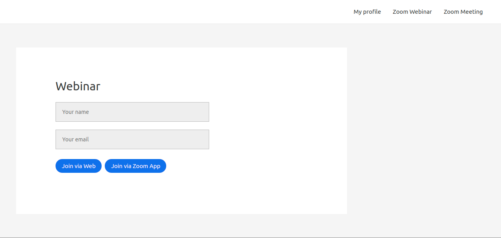
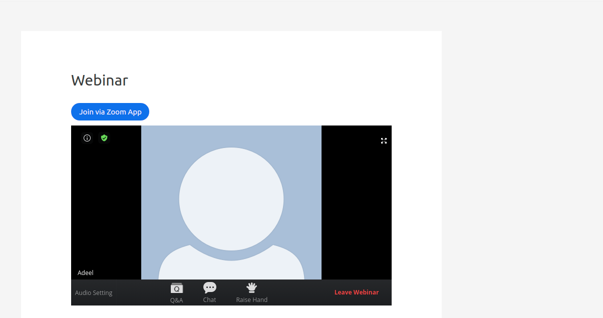

# How to embed Zoom Webinar on your website

Steps to embed Zoom webinars on your website.

<AuthorBlock />

This post will help you embed Zoom webinar on your WordPress website. It requires that you have purchased the Webinar add on from your Zoom account and installed [Zoomy](https://wpzoomy.com/) (the Zoom WordPress Plugin).

## Steps to Embed Zoom Webinar

1. From your WordPress Dashboard navigate to Zoom Meetings -> Add Webinar. Once you fill in the details and click Create Webinar on this page, a shortcode will be generated on the same page which can be embedded anywhere on your site.

    

2. If you are embedding the Zoom webinar shortcode directly on your page, please add is_webinar="1" in the shortcode as indicated below.

    

3. You can easily embed the Webinar with the Gutenberg block available with the plugin and place your Webinar ID inside it. If you are not using the default WordPress editor (Gutenberg), you can see another option to embed the Webinar on your WordPress page in this post.

a.   

4. Navigate to the WordPress page where the Webinar was embedded with a logged-in site administrator or the meeting host (same WordPress login email as the Webinar host email). Click Join via Web if you want to start the Webinar as a host right from the WordPress site or click Join Via Zoom App to begin the Webinar from the Zoom App.

a.  

5. Once started by the host the attendees can visit the page, enter their name, and email, and click Join Via Web to enter it from the same WordPress page without the need for a Zoom app.

a.  **Note:** If the attendee is logged into the WordPress site then they will see the email field as that is prefilled with their WP login email.

b.   

6. Once an attendee clicks the Join via Web they will see the Webinar window on the WordPress page.

a.   

That's it. If you have any other questions feel free to reach out here or comment below!
