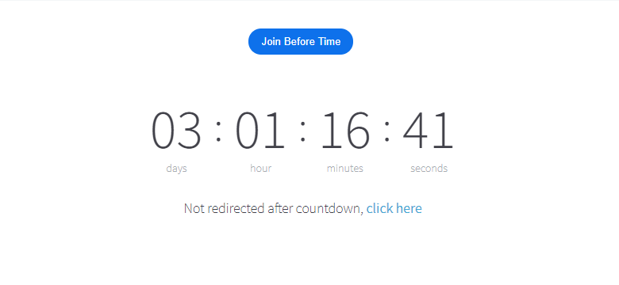

<AuthorBlock />

The Recurring Meetings addon for the [**Zoomy - WordPress Plugin**] (https://wpzoomy.com/)will enable you to set up recurring Zoom meetings or webinars right from the comfort of your WordPress dashboard.

It **removes the hassle** for WordPress admins to update the starting time of a Zoom meeting each time. The addon can enable you to simply schedule the meeting once from your dashboard then, sit back and relax!

## Backend Functionality

You will be able to schedule your Zoom meetings or webinars as daily, weekly, or monthly in just a few simple clicks. There are a multitude of ways to set a schedule, the addon enables you to make use of all the possible recurring meeting options available by Zoom.

## Recurring Meeting Countdown
This addon is required to update the countdown for each occurrence of a recurring meeting accordingly.
​

There are 2 ways in which the countdown is updated for the next occurrence of a recurring meeting or webinar.

**1. Realtime via Zoom Event (Requires [**event subscription**](https://zoom.us/pricing/events)):**

The countdown will update to the next occurrence of the recurring meeting as soon as the current meeting is ended by the host. It is required that the meeting is ended by the host **after** the specified meeting Duration.

**2. Hourly via Cronjob:**

This is a fallback method in case the countdown is not updated in realtime. The cronjob automatically runs in the background when you install the addon. It updates the recurring meeting countdown to the next occurrence of the meeting at an hourly interval.

## Prerequisites

1. [**Zoom WordPress Plugin**](https://wpzoomy.com/) (at least v3.3.1)

## Configuration Steps

1. Once you Purchase the addon, you will receive a license key and plugin file via email.

2. Upload the plugin zip file to your WP site.

3. Add the License key to Zoom Meetings -> Extensions -> Recurring Meetings Addon and click activate. This will enable you to use the recurring meetings feature in your Zoom meetings.
