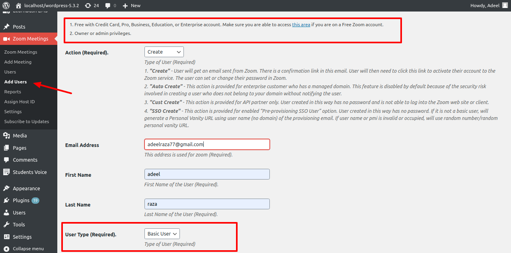
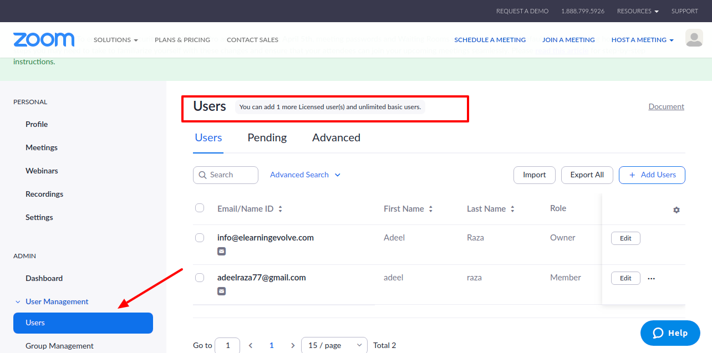
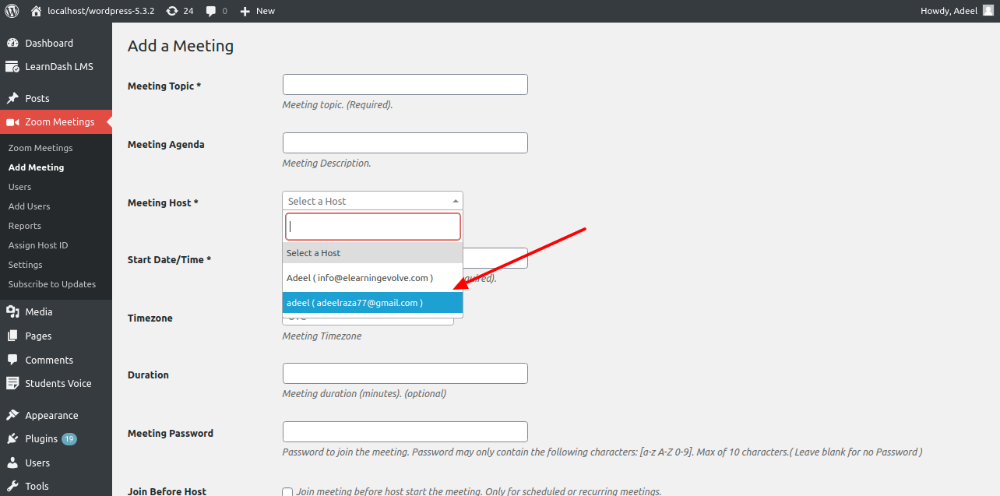

# Multiple hosts on Zoom

This blog is dedicated to helping you configure multiple hosts on Zoom with the [**Zoomy WordPress Plugin**](https://wpzoomy.com/). So here's how you can do that with a basic-level Zoom user.

## Basic User: Multiple hosts on Zoom

**_IMPORTANT:_** _Please check the Prerequisites highlighted in the image below, you will not be able to use this feature with a Free account without a credit card. There are specific features that are only available to Pro users in Zoom like the cloud recording feature for the meeting._

1. You can add a basic user type (free account level) from the plugin Zoom meetings -> Add user. Please make sure you fulfill the prerequisites for using this feature.

   

2. Enter the email of the user whom you want to make the meeting host. This will create a free Zoom user in your Zoom account. The user will receive an email to accept the invite from Admin. Once they accept the invite you will now see the user email in the meeting host dropdown.

   

3. Now, simply create a meeting with this host and place the meeting shortcode on any of your WordPress pages. The new host will now be able to start this meeting without the administrator.

## Pro User: Multiple hosts on Zoom

**IMPORTANT:** Please note that in order to create a Pro user type user you must have purchased a [**Pro Zoom host**](https://zoom.us/pricing). If you haven't purchased a host you will not be able to use this configuration. You can see if you are eligible to create a licensed user from your main Zoom account [here](https://zoom.us/signin#/login).

1. You can add a Pro user type (Licensed user) from the plugin Zoom meetings -> Add user.

2. Enter the email of the Pro level user whom you want to make the meeting host. This will create a licensed Zoom user in your Zoom account. The user will receive an email to accept the invite from Admin. Once they accept the invite you will now see the user email in the meeting host dropdown.

 

3. Apart from adding them as the main host for the meeting, you have the option to use the alternative host feature which is only available for Pro/Licensed users. By adding them as an alternative host the user will have the ability to start the meeting just like the admin user.

4. Now, simply create a meeting with this host and place the meeting shortcode on any of your WordPress pages. The alternative host will now be able to start this meeting without the administrator. That's it!
